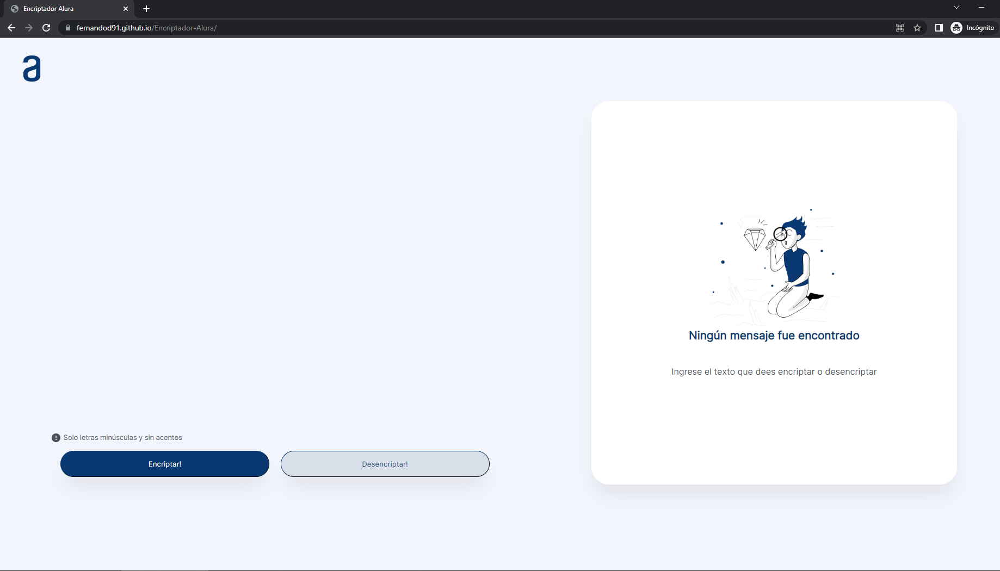
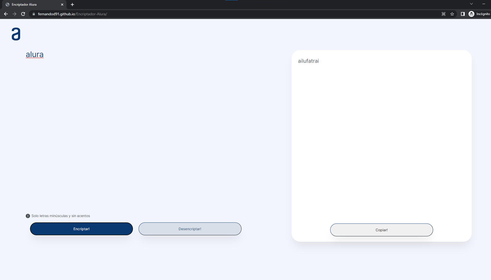

# Encriptador-Alura

##  link: https://fernandod91.github.io/Encriptador-Alura/

```
Se diseño una pagina para encriptar texto segun los requerimientos pedidos por  "One alura latam":

Las "llaves" de encriptación que utilizaremos son las siguientes:

La letra "e" es convertida para "enter"
La letra "i" es convertida para "imes"
La letra "a" es convertida para "ai"
La letra "o" es convertida para "ober"
La letra "u" es convertida para "ufat"

Requisitos:
- Debe funcionar solo con letras minúsculas
- No deben ser utilizados letras con acentos ni caracteres especiales
- Debe ser posible convertir una palabra para la versión encriptada también devolver una palabra encriptada para su versión original.

Por ejemplo:
"gato" => "gaitober"
gaitober" => "gato"

La página debe tener campos para
inserción del texto que será encriptado o desencriptado, y el usuario debe poder escoger entre as dos opciones.
El resultado debe ser mostrado en la pantalla.

```
### Diseño en figma

> https://www.figma.com/file/trP3p5nEh7XUyB3n2bomjP/Alura-Challenge---Desaf%C3%ADo-1---L%C3%B3gica?node-id=0%3A1&t=3htzdmlS9w7UiNx3-0


---

## Proyecto Terminado:




